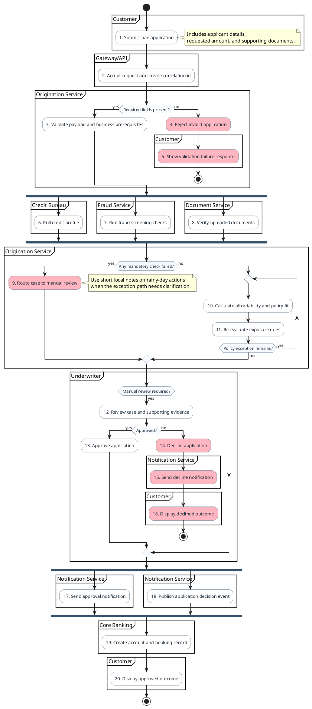
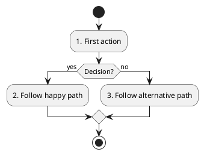

# Prompt: Generate Activity Diagram

Generate a markdown document containing a PlantUML activity diagram script, numbered step descriptions, and short assumptions from the specification, selected text, or attached source material in chat.

Before drafting, study the full PlantUML example below and use it as a scripting reference for:
- partitions for grouped responsibility areas such as `partition "API" { ... }`
- swimlanes using lane markers such as `|Customer|` and `|Service|` when requested or when they fit better than partitions
- manual numbering embedded in action labels because PlantUML activity diagrams do not support sequence-style `autonumber`
- decisions with `if`, `else`, and `endif`
- loops with `repeat` and `repeat while`
- concurrent work with `fork`, `fork again`, and `end fork`
- rainy-day highlighting using `#LightPink` on failure or exception activities, with short local notes where needed
- note placement and concise explanatory note style
- clear, business-readable activity labels

Treat the example as a pattern for structure and syntax, not as domain content to copy. Reuse the style, but rename lanes, activities, decisions, and notes to match the user's source material.

## Inlined reference example

## When to use this prompt
- When you have prose requirements, a specification, or partial notes and want a PlantUML activity diagram script
- When the workflow is better expressed as actions, decisions, loops, and concurrent branches than as message exchanges
- When swimlanes are needed to show responsibility boundaries across actors, teams, or systems
- When you want happy-path, failure-path, or combined operational flows documented in one artifact

## Source rules
- Prefer source material explicitly attached to chat or selected in the editor.
- If the source is insufficient, infer only what is reasonably supported and call out assumptions briefly in the `# Short Assumptions` section.
- If no usable source material is available, ask the user for the specification, notes, or selected text before drafting.

## Required modeling rules
- Output a valid PlantUML activity diagram script.
- PlantUML activity diagrams do not support built-in `autonumber`; when numbering is required, manually number meaningful actions in the node labels, for example `:1. Receive request;`.
- Start with `@startuml "<title>"`.
- Prefer `partition` blocks by default to show grouped responsibility areas, phases, or system boundaries.
- Use lane markers such as `|Customer|` only when the user explicitly asks for lanes or when lane-style handoffs make the flow clearer than partitions.
- Use formal PlantUML activity syntax where appropriate, including `start`, `stop`, `if`, `else`, `endif`, `repeat`, `repeat while`, `fork`, `fork again`, and `end fork`.
- Add concise `note right`, `note left`, or `note` blocks where clarification materially helps interpretation.
- Highlight rainy-day actions with `#LightPink` when failure, exception, timeout, retry, compensation, or recovery paths are shown.
- Keep rainy-day notes short and local to the failure activity they clarify.
- Keep action labels short, concrete, and business-readable.
- Number only meaningful actions; do not number decorative separators or purely visual constructs.
- Keep numbering stable and sequential within the final diagram.

## Scenario handling
- If the user explicitly requests `sunny`, show the happy path only.
- If the user explicitly requests `rainy`, show only the key failure, timeout, retry, compensation, exception, or recovery paths.
- If the user explicitly requests `both`, include both sunny and rainy paths.
- If the user does not specify a scenario mode, use a context-driven default: include both when the source clearly describes important exceptions or recovery behavior; otherwise default to sunny.

## Grouping handling
- If the user explicitly requests `partition`, structure the diagram with `partition` blocks.
- If the user explicitly requests `lane`, structure the diagram with lane markers such as `|Customer|`.
- If the user does not specify a grouping style, default to `partition`.
- If the source describes frequent cross-responsibility handoffs and lane markers would make the process materially easier to read, you may use lanes instead of partitions and note that choice in `# Short Assumptions`.

## Diagram construction process
1. Extract the workflow title or synthesize a short title from the source.
2. Identify the main responsibility boundaries and decide whether they should be modeled as partitions or lanes.
3. Map the core activity flow in business order.
4. Add decisions, loops, and concurrent branches only where they are supported by the source or strongly implied by the described behavior.
5. Add rainy-day highlighting for failure-oriented actions when those paths are present.
6. Add notes only where they materially clarify intent, constraints, or edge cases.
7. Apply manual numbering to meaningful actions in the order the user should read the process.
8. Keep the diagram focused on one workflow or one coherent business process.

## Output format
- Output markdown only.
- Structure the response as a markdown document with exactly these sections in this order:
  - `# Diagram Script`
  - `# Steps`
  - `# Short Assumptions`
- In `# Diagram Script`, provide a fenced `plantuml` block containing only the script.
- In `# Steps`, provide a numbered list whose numbering matches the manually numbered actions in the diagram.
- Include one step entry for each meaningful numbered action in the diagram.
- Keep each step description short, concrete, and business-readable.
- In `# Short Assumptions`, list only the assumptions or inferred details needed to complete the diagram. If no assumptions were needed, state `None.`
- If the source is too ambiguous to produce a responsible diagram, ask a short clarifying question instead of guessing.

## Quality bar
- Ensure the PlantUML syntax is structurally valid.
- Preserve the style and readability demonstrated by the inlined example.
- Ensure the `# Steps` section remains synchronized with the manually numbered actions in the diagram.
- Prefer clarity over exhaustiveness; do not invent large subsystems, rules, or exception flows that are not supported.
- Keep notes short and useful.
- Avoid over-modeling with too many lanes or branches when a simpler workflow communicates the process better.

## Markdown output template

~~~~markdown
# Diagram Script

# Steps
1. {Description aligned to manual step 1}
2. {Description aligned to manual step 2}
3. {Description aligned to manual step 3}

# Short Assumptions
- {Only inferred details that were necessary}
~~~~

## Example invocation ideas
- `/generate-activity-diagram Create an order-fulfilment activity diagram from the attached spec. Scenario: both. Grouping: partition.`
- `/generate-activity-diagram Generate a claims-submission workflow from the selected text. Grouping: lane. Swimlanes: customer, API, workflow service, assessor.`
- `/generate-activity-diagram Use the attached notes to create a retry and exception focused activity diagram for document ingestion. Scenario: rainy. Highlight rainy-day actions in LightPink.`
