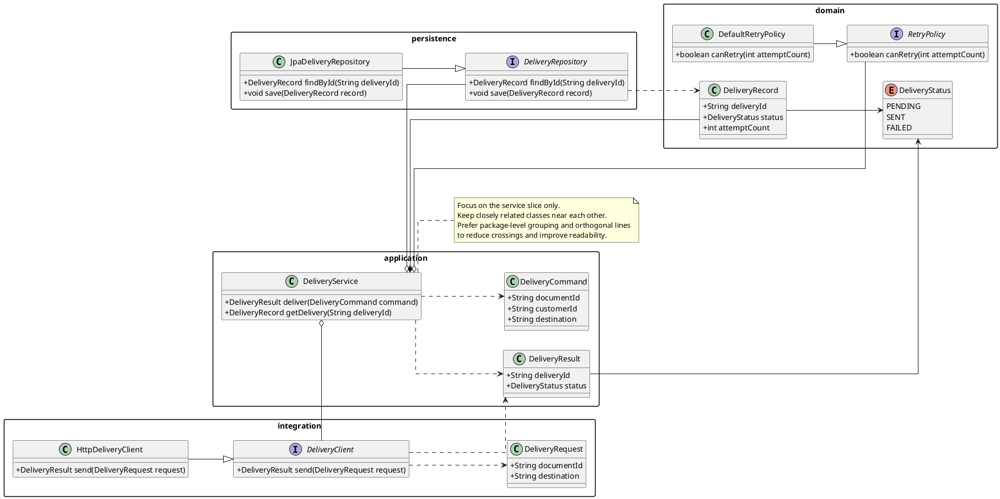
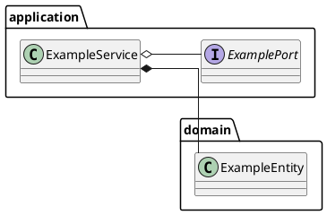

# Prompt: Generate Class Diagram

Generate a markdown document containing a focused PlantUML class diagram script, structural notes, and short assumptions from the specification, selected text, attached source material, or a user-provided list of related classes.

Before drafting, study the full PlantUML example below and use it as a scripting reference for:
- focused package-scoped structural modeling for one service slice
- multiple related packages at the same structural level when the design spans adjacent concerns
- interfaces, classes, enums, and concrete implementations
- inheritance, implementation, association, aggregation, and composition relationships
- concise method signatures and type references only where they materially clarify design intent
- readable grouping, low-crossing relationship direction, and squarish layout
- notes that explain design intent rather than restating names

Treat the example as a pattern for structure and syntax, not as domain content to copy. Reuse the style, but rename packages, types, relationships, and notes to match the user's source material.

## Inlined reference example

## When to use this prompt
- When you want to model the structural design for one part of a service, feature, or bounded slice
- When you have a list of related classes and want a focused class diagram rather than a full codebase map
- When you want to infer related classes from a specification, feature description, or selected text
- When interfaces, implementations, enums, and object relationships matter more than runtime flow

## Source rules
- Prefer source material explicitly attached to chat or selected in the editor.
- If the user provides a list of related classes, focus on those classes and the minimum supporting types needed to make the structure understandable.
- If the user asks to model part of a specification, infer only the classes, interfaces, enums, and relationships reasonably supported by that specification slice.
- If the source is insufficient, infer only what is reasonably supported and call out assumptions briefly in the `# Short Assumptions` section.
- If no usable source material is available, ask the user for the specification, notes, or related classes before drafting.

## Required modeling rules
- Output a valid PlantUML class diagram script.
- Start with `@startuml "<title>"`.
- Keep the diagram focused on one service slice, feature area, or cohesive structural boundary.
- Prefer package or namespace grouping when it improves readability.
- When the design spans adjacent concerns, prefer multiple peer-level packages rather than one oversized package.
- Include only the classes, interfaces, enums, abstract types, and value objects that materially clarify the design.
- Show implementation, inheritance, association, aggregation, composition, dependency, or enum usage relationships only when they are supported by the source or strongly implied.
- Prefer concise method signatures or core attributes only when they materially clarify responsibility or type relationships.
- Avoid turning the diagram into a full source-code dump.
- Favor a squarish, readable layout with few crossing lines.
- Keep closely related classes physically near each other.
- Prefer orthogonal lines and simple relationship directions when they improve readability.
- Use notes sparingly to clarify architectural intent, scope, or modeling decisions.
- Keep names concrete and aligned with the source material.

## Diagram construction process
1. Extract the structural slice title or synthesize a short title from the source.
2. Identify the central service or feature boundary being modeled.
3. Determine the key related classes, interfaces, enums, repositories, clients, commands, records, or value objects.
4. Group those types into a small number of peer-level packages when package boundaries improve readability.
5. Place closely related classes near each other and add the minimum useful relationships needed to explain the structure.
6. Include attributes or methods only where they make the design materially easier to understand.
7. Add notes only where they clarify design intent, scope, or non-obvious relationships.
8. Keep the diagram focused on one coherent design slice and optimize for clean visual layout.

## Output format
- Output markdown only.
- Structure the response as a markdown document with exactly these sections in this order:
  - `# Diagram Script`
  - `# Structural Notes`
  - `# Short Assumptions`
- In `# Diagram Script`, provide a fenced `plantuml` block containing only the script.
- In `# Structural Notes`, provide a short bullet list summarizing the key structural decisions, relationships, and responsibilities shown in the diagram.
- Keep each structural note short, concrete, and design-focused.
- In `# Short Assumptions`, list only the assumptions or inferred details needed to complete the diagram. If no assumptions were needed, state `None.`
- If the source is too ambiguous to produce a responsible diagram, ask a short clarifying question instead of guessing.

## Quality bar
- Ensure the PlantUML syntax is structurally valid.
- Preserve the focused structural style demonstrated by the inlined example.
- Ensure the `# Structural Notes` section matches the diagram rather than introducing new design facts.
- Prefer clarity over exhaustiveness; do not invent large object models, persistence structures, or frameworks that are not supported.
- Keep notes short and useful.
- Favor clean package-level organization, short visual distance between related classes, and minimal line crossings.
- Avoid clutter from low-value fields, methods, or relationships when a smaller diagram communicates the design better.

## Markdown output template

~~~~markdown
# Diagram Script

# Structural Notes
- {Key structural responsibility}
- {Important relationship or implementation detail}

# Short Assumptions
- {Only inferred details that were necessary}
~~~~

## Example invocation ideas
- `/generate-class-diagram Create a focused class diagram for the document delivery slice from the attached spec. Emphasis: interfaces, composition, and enums.`
- `/generate-class-diagram Model these related classes: DeliveryService, DeliveryClient, DeliveryRepository, DeliveryRecord, DeliveryStatus.`
- `/generate-class-diagram Use the selected specification text to infer the related classes for the payment authorization feature and keep the diagram focused.`
