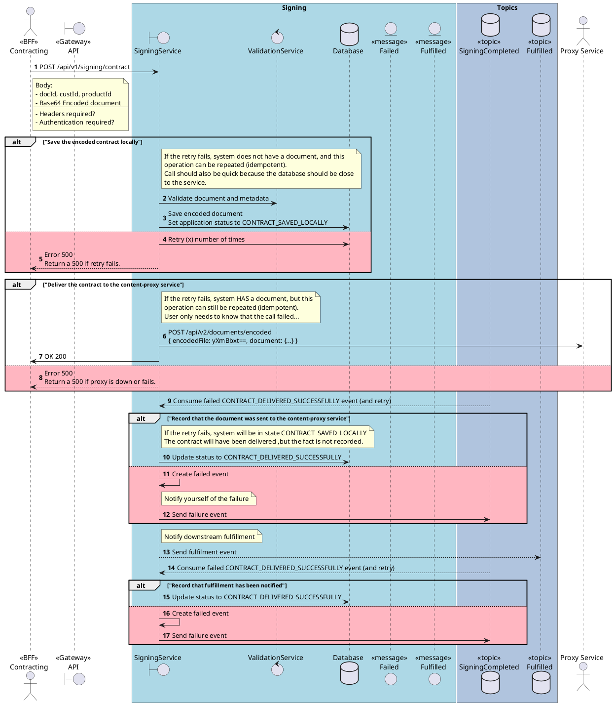

# Prompt: Generate Sequence Diagram

Generate a markdown document containing a PlantUML sequence diagram script, numbered step descriptions, and short assumptions from the specification, selected text, or attached source material in chat.

Before drafting, study the full PlantUML example below and use it as a scripting reference for:
- participant declarations and robustness stereotypes
- `autonumber` usage and interaction ordering
- `box` grouping for subsystem boundaries
- note placement and explanatory note style
- `alt` and `else` structure, including rainy-day `#LightPink` branches
- concise, business-readable message labels

Treat the example as a pattern for structure and syntax, not as domain content to copy. Reuse the style, but rename participants, messages, boundaries, and notes to match the user's source material.

## Inlined reference example



## When to use this prompt
- When you have prose requirements, a specification, or partial notes and want a PlantUML sequence diagram script
- When numbering, stereotypes, and robustness-style participant types are important
- When you want the diagram to distinguish sunny-day, rainy-day, or both scenarios
- When the interaction benefits from notes, boxes, conditions, loops, retries, or failure handling

## Source rules
- Prefer source material explicitly attached to chat or selected in the editor.
- If the source is insufficient, infer only what is reasonably supported and call out assumptions briefly in the `# Short Assumptions` section.
- If no usable source material is available, ask the user for the specification, notes, or selected text before drafting.

## Required modeling rules
- Output a valid PlantUML sequence diagram script.
- Start with `@startuml "<title>"` and include `autonumber` near the top.
- Ensure the message flow can be documented as numbered steps that align with the sequence generated by `autonumber`.
- Identify the main external actors, system boundaries, internal services, data stores, and relevant entities/messages.
- Use robustness-style participant types where appropriate:
  - `actor` for external actors or users
  - `boundary` for APIs, gateways, UIs, facades, or service boundaries
  - `control` for orchestration, business logic, controllers, validators, processors, or workflow services
  - `database` for data stores, topics, queues, or repositories when they are best represented as persistent/message stores
  - `entity` for important domain objects, documents, payloads, events, or message artifacts when relevant
- Use stereotypes in labels where helpful, for example `<<BFF>>`, `<<Gateway>>`, `<<topic>>`, or `<<message>>`.
- Group major subsystems with `box` blocks where this improves readability.
- Add concise `note right of`, `note left of`, or `note over` blocks where clarification materially helps interpretation.
- Use formal PlantUML control structures when the flow requires them, including `alt`, `else`, `opt`, `loop`, `par`, and `break`.
- When both success and failure paths are included, render rainy-day `else` branches with `#LightPink`.
- Add entities only where they materially clarify the interaction or exchanged artifact.

## Scenario handling
- If the user explicitly requests `sunny`, show the happy path only.
- If the user explicitly requests `rainy`, show only the key failure, retry, timeout, compensation, or recovery paths.
- If the user explicitly requests `both`, include both sunny and rainy paths.
- If the user does not specify a scenario mode, use a context-driven default: include both when the source clearly describes important failure handling; otherwise default to sunny.

## Diagram construction process
1. Extract the use case title or synthesize a short title from the source.
2. Identify the initiating actor and the first system boundary crossed.
3. Map the main interaction sequence in business order.
4. Add internal control components, data stores, topics, and entities only where they are meaningful to the scenario.
5. Model conditionals, retries, loops, or asynchronous steps only when supported by the source or strongly implied by the described behavior.
6. Keep naming concrete and business-readable.
7. Keep the diagram focused on one use case or one coherent interaction.

## Output format
- Output markdown only.
- Structure the response as a markdown document with exactly these sections in this order:
  - `# Diagram Script`
  - `# Steps`
  - `# Short Assumptions`
- In `# Diagram Script`, provide a fenced `plantuml` block containing only the script.
- In `# Steps`, provide a numbered list whose numbering matches the diagram's `autonumber` sequence as closely as possible.
- Include one step entry for each meaningful numbered interaction in the diagram.
- Keep each step description short, concrete, and business-readable.
- In `# Short Assumptions`, list only the assumptions or inferred details needed to complete the diagram. If no assumptions were needed, state `None.`
- If the source is too ambiguous to produce a responsible diagram, ask a short clarifying question instead of guessing.

## Quality bar
- Ensure the PlantUML syntax is structurally valid.
- Preserve numbering, participant stereotypes, and visual intent from the style guide.
- Ensure the `# Steps` section remains synchronized with the actual numbered interaction flow in the diagram.
- Prefer clarity over exhaustiveness; do not invent large subsystems, endpoints, or data contracts that are not supported.
- Keep notes short and useful.
- Avoid over-modeling with too many lifelines when a simpler diagram communicates the flow better.

## Markdown output template

~~~~markdown
# Diagram Script
```plantuml
@startuml "<title>"
autonumber
...
@enduml
```

# Steps
1. {Description aligned to autonumber 1}
2. {Description aligned to autonumber 2}

# Short Assumptions
- {Only inferred details that were necessary}
~~~~

## Example invocation ideas
- `/generate-sequence-diagram Create the onboarding flow from the attached spec. Scenario: both.`
- `/generate-sequence-diagram Generate the payment authorization interaction from the selected text. Scenario: sunny.`
- `/generate-sequence-diagram Use the attached notes to create a retry-focused failure flow for document delivery. Scenario: rainy.`
