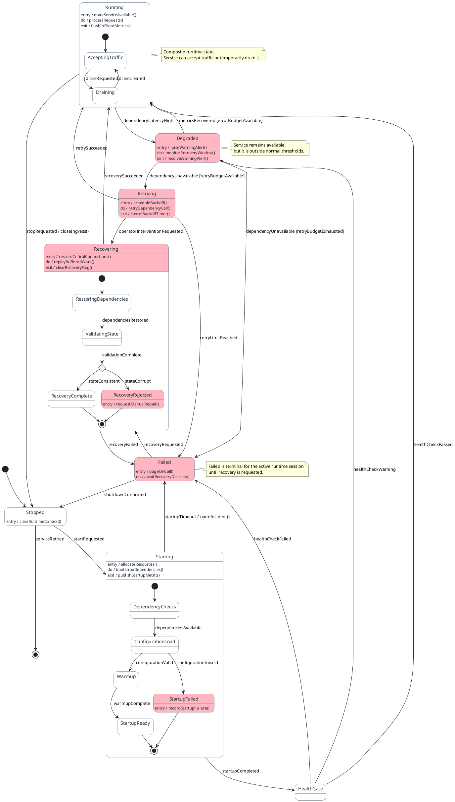
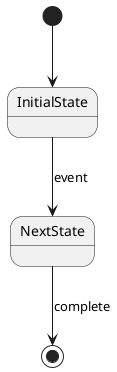

# Prompt: Generate State Diagram

Generate a markdown document containing a PlantUML state diagram script, numbered lifecycle step descriptions, and short assumptions from the specification, selected text, or attached source material in chat.

Before drafting, study the full PlantUML example below and use it as a scripting reference for:
- initial and final states using `[*]`
- clear transition labels using domain-relevant events, triggers, or outcomes
- choice states using `<<choice>>`
- composite states with nested substates when they materially improve clarity
- entry, do, and exit actions attached to state names
- rainy-day highlighting using `#LightPink` on degraded, failed, or recovery-required states
- concise notes that explain why a state or transition matters
- readable state-machine structure without unnecessary nesting

Treat the example as a pattern for structure and syntax, not as domain content to copy. Reuse the style, but rename states, transitions, notes, and actions to match the user's source material.

## Inlined reference example

## When to use this prompt
- When you have prose requirements, a specification, or partial notes and want a PlantUML state diagram script
- When the problem is best expressed as a lifecycle, state machine, status progression, or recovery model
- When states, guards, nested substates, retries, degradation, recovery, or failure transitions are important
- When you want sunny-day, rainy-day, or combined lifecycle views documented in one artifact

## Source rules
- Prefer source material explicitly attached to chat or selected in the editor.
- If the source is insufficient, infer only what is reasonably supported and call out assumptions briefly in the `# Short Assumptions` section.
- If no usable source material is available, ask the user for the specification, notes, or selected text before drafting.

## Required modeling rules
- Output a valid PlantUML state diagram script.
- Start with `@startuml "<title>"`.
- Use initial and final states with `[*]` where lifecycle entry or exit is meaningful.
- Use clear transition labels with events, triggers, outcomes, and guards when supported by the source.
- Use `<<choice>>` only when a real decision point improves clarity.
- Use composite states only when nested substates materially improve readability.
- Attach `entry`, `do`, and `exit` actions to state names, not inside composite state blocks.
- Add concise `note right of`, `note left of`, or `note over` blocks where clarification materially helps interpretation.
- Highlight rainy-day states with `#LightPink` when failure, degradation, retry exhaustion, or recovery-required paths are shown.
- Keep nesting shallow and readable. Avoid deep or decorative hierarchy.
- Keep state names and transition labels concrete and business-readable.

## Scenario handling
- If the user explicitly requests `sunny`, show the happy-path or nominal lifecycle only.
- If the user explicitly requests `rainy`, show only the key failure, degradation, retry, timeout, compensation, or recovery paths.
- If the user explicitly requests `both`, include both nominal and exception paths.
- If the user does not specify a scenario mode, use a context-driven default: include both when the source clearly describes important failure or recovery behavior; otherwise default to sunny.

## Diagram construction process
1. Extract the lifecycle title or synthesize a short title from the source.
2. Identify the main states, lifecycle start, and lifecycle end conditions.
3. Map the primary transitions in business order.
4. Add guards, choices, retries, degraded states, or recovery states only where they are supported by the source or strongly implied by the described behavior.
5. Add composite states only when internal substates materially improve clarity.
6. Add notes only where they clarify state meaning, transition intent, or lifecycle constraints.
7. Keep the diagram focused on one lifecycle or one coherent state machine.

## Output format
- Output markdown only.
- Structure the response as a markdown document with exactly these sections in this order:
  - `# Diagram Script`
  - `# Steps`
  - `# Short Assumptions`
- In `# Diagram Script`, provide a fenced `plantuml` block containing only the script.
- In `# Steps`, provide a numbered list describing the meaningful lifecycle progression represented by the diagram.
- Number the `# Steps` list manually. State diagrams do not have a built-in sequence-style `autonumber`.
- Keep each step description short, concrete, and business-readable.
- In `# Short Assumptions`, list only the assumptions or inferred details needed to complete the diagram. If no assumptions were needed, state `None.`
- If the source is too ambiguous to produce a responsible diagram, ask a short clarifying question instead of guessing.

## Quality bar
- Ensure the PlantUML syntax is structurally valid.
- Preserve the style and readability demonstrated by the inlined example.
- Ensure the `# Steps` section remains synchronized with the lifecycle represented by the diagram.
- Prefer clarity over exhaustiveness; do not invent states, transitions, guards, or recovery mechanisms that are not supported.
- Keep notes short and useful.
- Avoid over-modeling with too many nested states when a simpler lifecycle communicates the system better.

## Markdown output template

~~~~markdown
# Diagram Script

# Steps
1. {Description of lifecycle entry or first meaningful state transition}
2. {Description of next meaningful transition or decision}
3. {Description of completion, failure, or recovery progression}

# Short Assumptions
- {Only inferred details that were necessary}
~~~~

## Example invocation ideas
- `/generate-state-diagram Create a document-processing lifecycle from the attached spec. Scenario: both. Emphasis: failure recovery.`
- `/generate-state-diagram Generate a service runtime lifecycle from the selected text. Emphasis: composite states and guarded transitions.`
- `/generate-state-diagram Use the attached notes to create a retry and degradation focused state diagram for a messaging consumer. Scenario: rainy.`
