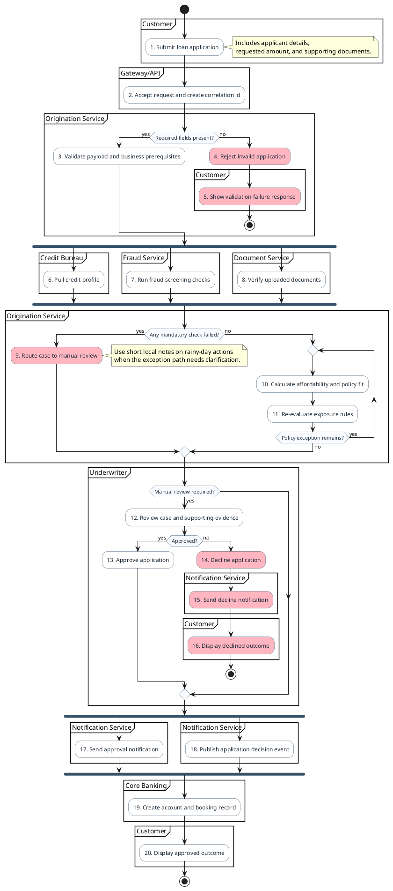

# Activity Diagram Reference

## When to Use

- Workflows expressed as actions, decisions, loops, and concurrent branches
- Responsibility boundaries shown as partitions or swimlanes
- Happy-path, failure-path, or combined operational flows
- Processes where swimlanes clarify actor or system responsibilities

---

## Inlined Reference Example



---

## Required Modeling Rules

- Start with `@startuml "<title>"`.
- PlantUML activity diagrams do not support `autonumber`; manually number meaningful actions in node labels, e.g. `:1. Receive request;`.
- Prefer `partition` blocks by default to show responsibility areas, phases, or system boundaries.
- Use lane markers such as `|Customer|` only when the user explicitly asks for lanes or when frequent cross-responsibility handoffs make lanes materially clearer than partitions.
- Use `start`, `stop`, `if`, `else`, `endif`, `repeat`, `repeat while`, `fork`, `fork again`, and `end fork` as appropriate.
- Add concise `note right`, `note left`, or `note` blocks where clarification materially helps.
- Highlight rainy-day actions with `#LightPink`; keep rainy-day notes short and local.
- Number only meaningful actions; do not number decorative separators.
- Keep numbering stable and sequential in the final diagram.

---

## Scenario Handling

| Requested | Show |
|-----------|------|
| `sunny` | Happy path only |
| `rainy` | Key failure, timeout, retry, compensation, exception, or recovery paths only |
| `both` | Both sunny and rainy paths |
| Not specified | Context-driven: include both if source describes important exceptions; otherwise default to sunny |

---

## Grouping Handling

| Requested | Use |
|-----------|-----|
| `partition` | `partition "Name" { ... }` blocks |
| `lane` | Lane markers such as `\|Customer\|` |
| Not specified | Default to `partition`; use lanes if frequent cross-responsibility handoffs make them materially clearer |

---

## Diagram Construction Process

1. Extract the workflow title or synthesize a short title from the source.
2. Identify the main responsibility boundaries; decide partition vs. lane.
3. Map the core activity flow in business order.
4. Add decisions, loops, and concurrent branches only where supported or strongly implied.
5. Add rainy-day highlighting for failure-oriented actions when those paths are present.
6. Add notes only where they materially clarify intent, constraints, or edge cases.
7. Apply manual numbering to meaningful actions in reading order.
8. Keep the diagram focused on one workflow or one coherent business process.

---

## Output Format Note

Output sections in this order:

```
# Diagram Script
# Steps          ← numbered list matching manual step numbers in the diagram
# Short Assumptions
```
