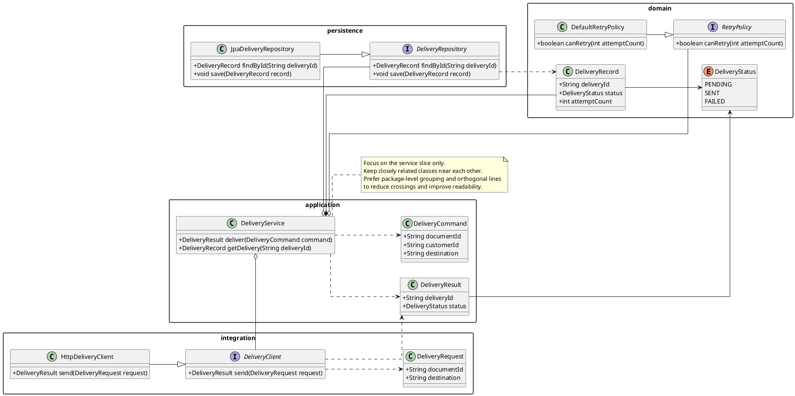

# Class Diagram Reference

## When to Use

- Structural design for one part of a service, feature, or bounded slice
- Modeling a user-provided list of related classes without producing a full codebase map
- Inferring related classes from a specification, feature description, or selected text
- When interfaces, implementations, enums, and object relationships matter more than runtime flow

---

## Inlined Reference Example



---

## Required Modeling Rules

- Start with `@startuml "<title>"`.
- Keep the diagram focused on one service slice, feature area, or cohesive structural boundary.
- Prefer package or namespace grouping when it improves readability.
- When the design spans adjacent concerns, prefer multiple peer-level packages over one oversized package.
- Include only classes, interfaces, enums, abstract types, and value objects that materially clarify the design.
- Show implementation, inheritance, association, aggregation, composition, dependency, or enum usage relationships only when supported or strongly implied.
- Include attributes or methods only where they make the design materially easier to understand.
- Avoid turning the diagram into a full source-code dump.
- Favor a squarish layout with few crossing lines; keep closely related classes physically near each other.
- Use orthogonal lines and simple relationship directions when they improve readability.
- Use notes sparingly to clarify architectural intent or non-obvious relationships.

---

## Diagram Construction Process

1. Extract the structural slice title or synthesize a short title from the source.
2. Identify the central service or feature boundary being modeled.
3. Determine the key related classes, interfaces, enums, repositories, clients, commands, records, or value objects.
4. Group those types into a small number of peer-level packages when package boundaries improve readability.
5. Place closely related classes near each other; add minimum useful relationships to explain the structure.
6. Include attributes or methods only where they make the design materially clearer.
7. Add notes only where they clarify design intent, scope, or non-obvious relationships.
8. Optimize for clean visual layout.

---

## Output Format Note

Output sections in this order:

```
# Diagram Script
# Structural Notes   ← short bullet list of key structural decisions, relationships, and responsibilities
# Short Assumptions
```
