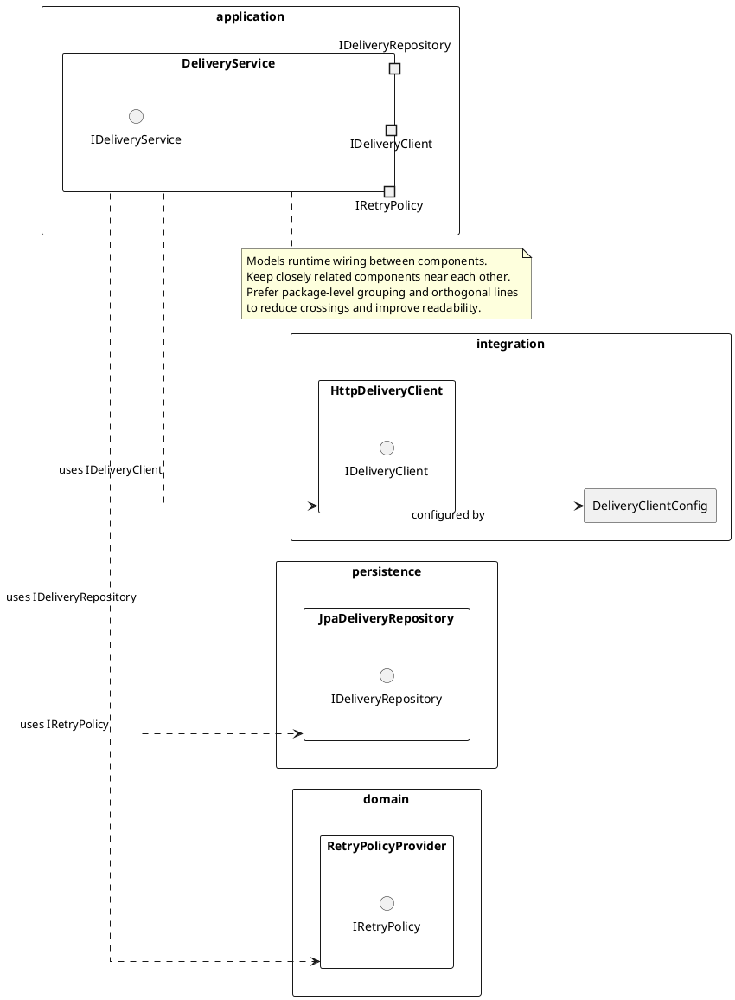

# Component Diagram Reference

## When to Use

- Runtime structure and wiring for one part of a service, feature, or bounded slice
- Modeling a user-provided list of related components without producing a full system map
- Interface contracts, provided/required ports, and inter-component dependencies matter more than class-level internals
- Inferring components from a specification, feature description, or selected text

---

## Inlined Reference Example



---

## Required Modeling Rules

- Start with `@startuml "<title>"`.
- Keep the diagram focused on one service slice, feature area, or cohesive structural boundary.
- Prefer package or namespace grouping when it improves readability.
- When the design spans adjacent concerns, prefer multiple peer-level packages over one oversized package.
- Include only components, interfaces, ports, and boundaries that materially clarify the design.
- Show provided interfaces, required interfaces, usage dependencies, and component-to-component relationships only when supported or strongly implied.
- Include interface labels or port names only where they make the design materially clearer.
- Avoid turning the diagram into a full source-code dump.
- Favor a squarish layout with few crossing lines; keep closely related components physically near each other.
- Use orthogonal lines and simple relationship directions when they improve readability.
- Use notes sparingly to clarify architectural intent or non-obvious relationships.

---

## Diagram Construction Process

1. Extract the structural slice title or synthesize a short title from the source.
2. Identify the central service or feature boundary being modeled.
3. Determine the key related components, interfaces, ports, clients, repositories, adapters, or external systems.
4. Group those elements into a small number of peer-level packages when package boundaries improve readability.
5. Place closely related components near each other; add minimum useful relationships to explain the structure.
6. Include interface labels or port names only where they make the design materially clearer.
7. Add notes only where they clarify design intent, scope, or non-obvious relationships.
8. Optimize for clean visual layout.

---

## Output Format Note

Output sections in this order:

```
# Diagram Script
# Structural Notes   ← short bullet list of key component responsibilities, boundaries, and dependency contracts
# Short Assumptions
```
