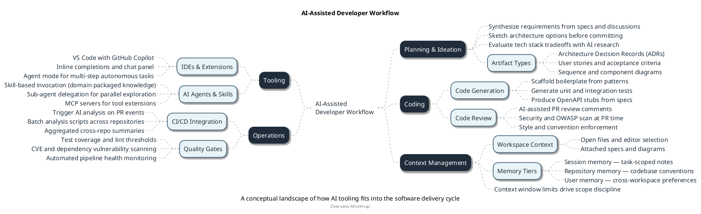

# Mindmap Diagram Reference

## When to Use

- Conceptual landscapes and knowledge overviews for a technology, tool ecosystem, or domain
- Comparing multiple strategies, approaches, or options side-by-side with a consistent per-option schema
- Structuring a workflow, methodology, or discipline into a visual hierarchy
- Exploring the facets of a concept for learning, onboarding, or orientation
- Documenting domain boundaries and their sub-topics at a glance

---

## Inlined Reference Example



---

## Required Modeling Rules

- Start with `@startmindmap "<title>"`.
- Always include `title`, `caption`, and `center footer` immediately after the opening tag.
- Root node uses a single `+`. Use `\n` for line breaks on multi-word root labels.
- First-level nodes: `++` for the right side, `--` for the left side. Target 4–7 total, balanced where possible.
- Deepen with `+++`/`---`, `++++`/`----`, etc. Hard limit: **5 levels below root**.
- Suffix `_` to a node to make it boxless (no border). Use for: prose descriptions, bullet-style facts, and any label longer than ~40 characters. Boxed nodes are for categories and headings only.
- Use `**bold**` to emphasise key terms within node labels. Use sparingly — one or two per diagram maximum.
- Always include a `<style>` block with `mindMapDiagram`:
  - Depth-0: neutral (white background, invisible border) — the root container.
  - Depth-1: visually prominent (dark background, light text) — the major domains.
  - Depth-2+: progressively lighter backgrounds — sub-categories and details.
  - `boxless`: set `MaximumWidth` between 300–400 to prevent text overflow on long leaf labels.
  - `arrow`: use a light dashed style (`LineStyle 4`, `LineThickness 0.5`) to reduce visual noise.
- **Comparison mode**: each first-level node represents one strategy or option. Apply a consistent sub-node schema per option: Definition → Suitable for → Evaluation (e.g. a risk or complexity rating). This makes options directly scannable side-by-side.
- **Overview mode**: first-level nodes represent the major facets or domains of the concept. Sub-nodes explore each domain independently; no cross-domain schema required.
- Do not invent topics, tools, or concepts not implied by the source material.

---

## Scenario Handling

Mindmaps have two independent parameters: **mode** and **scope**.

### Mode

| Mode | When | Behavior |
|------|------|----------|
| `overview` | Single concept to explore | Root = the concept; first-level nodes = its facets or domains |
| `comparison` | Multiple strategies or options to evaluate | Each first-level node = one option; apply consistent sub-schema per node |
| Not specified | Infer from prompt | "overview of X" or "breakdown of X" → `overview`; "compare X strategies" or "X approaches" → `comparison` |

### Scope

| Scope | When | Behavior |
|-------|------|----------|
| `auto` (default) | Always assess first | Check size thresholds; if exceeded → trunk output + `# Satellite Maps`; otherwise → single |
| `single` | Topic fits within thresholds | One complete mindmap at full depth |
| `trunk` | Exceeds thresholds or explicit request | Depth ≤ 2; branches needing expansion get a `[→ see: <satellite title>]` boxless leaf placeholder |
| `satellite <domain>` | Explicit expansion of one branch | Full-depth map for that domain only; `title` and `caption` reference the parent trunk |

### Size Thresholds (triggers for trunk split)

A `single` mindmap should be split into trunk + satellites when **any** of the following is true:

- First-level nodes > 7
- Any branch would exceed depth 5
- Any single branch would have > 8 leaf nodes
- Total estimated node count > ~65

When thresholds are exceeded and scope is `auto`, produce a trunk map and list the recommended satellite maps in `# Satellite Maps` rather than asking the user to choose.

### Trunk/Satellite Conventions

- **Trunk map**: maximum depth 2; any branch that requires deeper detail uses a `[→ see: <satellite title>]` boxless leaf as a placeholder. The trunk gives the full landscape at a glance.
- **Satellite map**: `title` and `caption` reference the parent trunk (e.g., `"AI-Assisted Developer Workflow — Tooling"`). Can go to full depth within its single domain.
- **`# Satellite Maps` section**: a bullet list of recommended follow-on maps with suggested titles, one per first-level domain that was truncated. Include these only in trunk-scope output.

---

## Diagram Construction Process

1. **Identify the root concept** from the source — this becomes the single `+` node. Keep the label short; use `\n` if wrapping improves readability.
2. **Identify 4–7 major domains or facets** (overview mode) or strategies/options (comparison mode) from the source material.
3. **Assess scope**: count planned first-level nodes and estimate depth and leaf density per branch. If any size threshold is exceeded, plan a trunk map with `[→ see: ...]` placeholders and note the satellite titles.
4. **Assign left/right balance**: alternate domains between `++` (right) and `--` (left) for visual symmetry. Group conceptually related domains on the same side where it aids readability.
5. **Populate sub-nodes**: use boxed category nodes for groupings that have children; use `_` leaf nodes for descriptive items, facts, or long labels. In comparison mode, apply the consistent sub-schema (Definition → Suitable for → Evaluation) to each first-level option node.
6. **Apply the `<style>` block**: use depth-based `BackgroundColor` and `FontColor` to create a clear visual hierarchy. Set `boxless` `MaximumWidth` to 300–400.
7. **Review and prune**: remove nodes that add no meaningful information; merge branches with fewer than two sub-items into their parent as a `_` leaf.

---

## Output Format Note

Output sections in this order:

```
# Diagram Script
# Structure Notes     ← root concept, first-level domain choices and rationale, key groupings; always present
# Satellite Maps      ← trunk scope only: bullet list of recommended follow-on satellite mindmaps with suggested titles
# Short Assumptions
```

Mindmaps have no execution flow; `# Steps` does not apply. `# Structure Notes` takes its place and explains the structural decisions made during construction.
