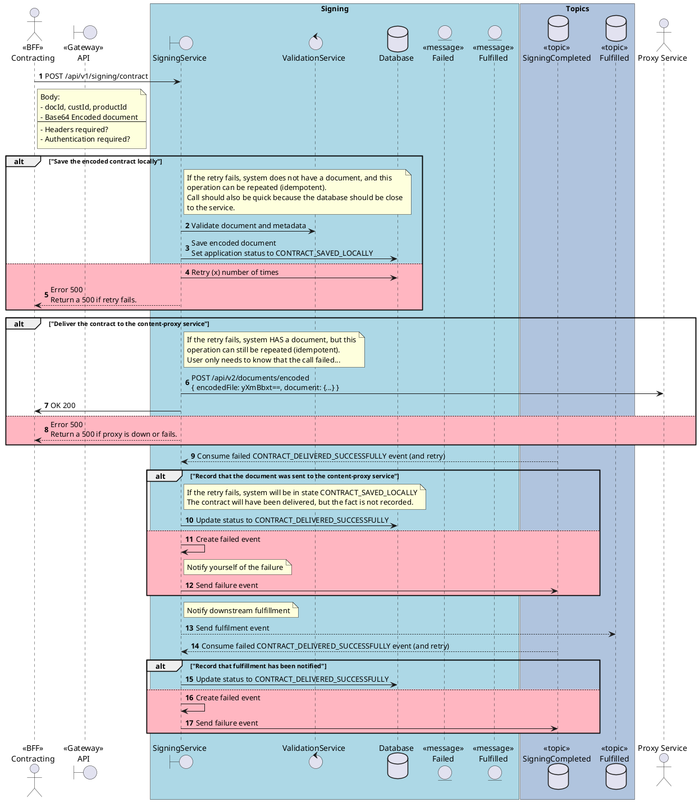

# Sequence Diagram Reference

## When to Use

- Message flow between external actors, service boundaries, and internal components
- Interactions that benefit from `autonumber`, stereotypes, and `box` groupings
- Flows with retries, conditionals, topics, or async messaging
- Sunny-day, rainy-day, or combined interaction scenarios

---

## Inlined Reference Example



---

## Required Modeling Rules

- Start with `@startuml "<title>"` and include `autonumber` near the top.
- Identify external actors, system boundaries, internal services, data stores, topics, and entities.
- Use robustness-style participant types:
  - `actor` — external actors or users
  - `boundary` — APIs, gateways, UIs, facades, or service boundaries
  - `control` — orchestration, business logic, validators, processors, or workflow services
  - `database` — data stores, topics, queues, or repositories as persistent/message stores
  - `entity` — domain objects, documents, payloads, events, or message artifacts when relevant
- Use stereotypes in labels where helpful: `<<BFF>>`, `<<Gateway>>`, `<<topic>>`, `<<message>>`.
- Group major subsystems with `box` blocks where this improves readability.
- Add concise `note right of`, `note left of`, or `note over` blocks where clarification materially helps.
- Use `alt`, `else`, `opt`, `loop`, `par`, and `break` for control flow when the source requires it.
- Render rainy-day `else` branches with `#LightPink`.

---

## Scenario Handling

| Requested | Show |
|-----------|------|
| `sunny` | Happy path only |
| `rainy` | Key failure, retry, timeout, compensation, or recovery paths only |
| `both` | Both sunny and rainy paths |
| Not specified | Context-driven: include both if source describes important failure handling; otherwise default to sunny |

---

## Diagram Construction Process

1. Extract the use case title or synthesize a short title from the source.
2. Identify the initiating actor and the first system boundary crossed.
3. Map the main interaction sequence in business order.
4. Add internal control components, data stores, topics, and entities only where meaningful.
5. Model conditionals, retries, loops, or async steps only when supported or strongly implied.
6. Keep naming concrete and business-readable.
7. Keep the diagram focused on one use case or one coherent interaction.

---

## Output Format Note

Output sections in this order:

```
# Diagram Script
# Steps          ← numbered list matching autonumber sequence
# Short Assumptions
```
