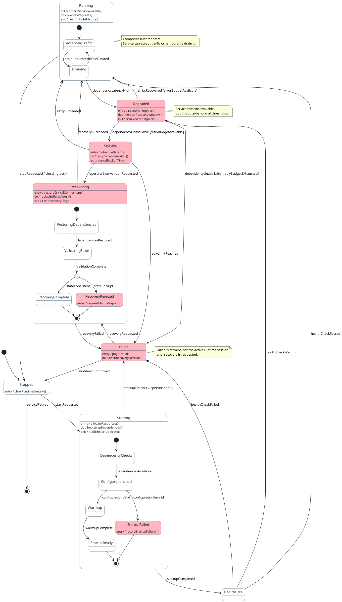

# State Diagram Reference

## When to Use

- Lifecycles, state machines, or status progressions for a service, entity, or process
- Workflows where states, guards, transitions, retries, degradation, and recovery matter
- Models with composite states or nested substates that improve clarity
- Sunny-day, rainy-day, or combined lifecycle views

---

## Inlined Reference Example



---

## Required Modeling Rules

- Start with `@startuml "<title>"`.
- Use `[*]` for initial and final states where lifecycle entry or exit is meaningful.
- Use clear transition labels with events, triggers, outcomes, and guards when supported.
- Use `<<choice>>` only when a real decision point improves clarity.
- Use composite states only when nested substates materially improve readability.
- Attach `entry`, `do`, and `exit` actions to state names (not inside composite state blocks).
- Add concise `note right of`, `note left of`, or `note over` blocks where clarification materially helps.
- Highlight rainy-day states with `#LightPink` for failure, degradation, retry exhaustion, or recovery-required paths.
- Keep nesting shallow; avoid deep or decorative hierarchy.
- Keep state names and transition labels concrete and business-readable.

---

## Scenario Handling

| Requested | Show |
|-----------|------|
| `sunny` | Happy-path or nominal lifecycle only |
| `rainy` | Key failure, degradation, retry, timeout, compensation, or recovery paths only |
| `both` | Both nominal and exception paths |
| Not specified | Context-driven: include both if source describes important failure or recovery behavior; otherwise default to sunny |

---

## Diagram Construction Process

1. Extract the lifecycle title or synthesize a short title from the source.
2. Identify the main states, lifecycle start, and lifecycle end conditions.
3. Map the primary transitions in business order.
4. Add guards, choices, retries, degraded states, or recovery states only where supported or strongly implied.
5. Add composite states only when internal substates materially improve clarity.
6. Add notes only where they clarify state meaning, transition intent, or lifecycle constraints.
7. Keep the diagram focused on one lifecycle or one coherent state machine.

---

## Output Format Note

Output sections in this order:

```
# Diagram Script
# Steps          ← manually numbered list describing the meaningful lifecycle progression
# Short Assumptions
```

State diagrams do not support `autonumber`; number the `# Steps` list manually.
